# microsvc.in — Self-Hosted Platform Bootstrap

<p align="center">
  
  
  
  
  
  
</p>

Idempotent, resumable, phase-based automation that builds the full platform on a fresh Ubuntu Server VM — from bare OS to a production-shaped, GitOps-driven Kubernetes platform with its own identity, CI/CD, observability, security gates, and disaster recovery.

**Status: all 9 phases implemented.**

---

## Platform architecture

<p align="center">
  
</p>

<p align="center"><sub>Each layer is a phase script under <code>phases/</code>. Layers build bottom-up — Foundation first, Validation last — and every step is idempotent, so re-running <code>run.sh</code> only touches what isn't already done.</sub></p>

---

## Table of contents

- [What gets built](#what-gets-built)
- [Design principles](#design-principles-baked-into-every-script)
- [Repository layout](#repository-layout)
- [Pinned component versions](#pinned-component-versions)
- [Cluster sizing minimums](#cluster-sizing-minimums)
- [Service endpoints](#service-endpoints)
- [Prerequisites](#prerequisites-do-these-once-out-of-band-before-running)
- [Running](#running)
- [Manual touchpoints (by design)](#manual-touchpoints-that-are-by-design-not-gaps)
- [Extending: adding a new microservice](#extending-adding-a-new-microservice)
- [Known limitations](#known-limitations--where-to-harden-further-before-real-production-use)

---

## What gets built

| # | Phase | Script | Delivers |
|---|-------|--------|----------|
| 1 | **Foundation** | `phase01-foundation.sh` | OS prep, sysctl tuning, K3s, Longhorn distributed storage |
| 2 | **Cluster Core** | `phase02-cluster-core.sh` | Traefik, cert-manager, wildcard TLS, ExternalDNS, Rancher |
| 3 | **Platform Services** | `phase03-platform-services.sh` | CloudNativePG Postgres, Redis, MinIO, Infisical, External Secrets Operator, Keycloak |
| 4 | **DevOps** | `phase04-devops.sh` | Harbor, GitLab, GitLab Runner, CI/CD smoke test |
| 5 | **GitOps** | `phase05-gitops.sh` | Argo CD, `gitops-config` repo, app-of-apps, Argo Rollouts |
| 6 | **Observability** | `phase06-observability.sh` | kube-prometheus-stack, Loki + Promtail, Tempo, OTel Collector |
| 7 | **Quality & Security** | `phase07-quality-security.sh` | SonarQube, Kyverno, Cosign, SBOM/secret/dependency/container scan CI templates |
| 8 | **Backup & DR** | `phase08-backup-dr.sh` | Velero, backup schedules, restore validation |
| 9 | **Validation** | `phase09-validation.sh` | Health/TLS/DNS/GitOps/CI-CD/DR validation matrix, exit-code driven |

## Design principles baked into every script

- **Idempotent** — every step checks current state before acting (`run_step` in `lib/common.sh` tracks completion in `/var/lib/microservice-platform/state.env`). Re-running the orchestrator never repeats finished work. Credentials are generated once via `get_or_create_secret_value` and read back unchanged on every subsequent run — re-running Phase 3 never rotates a password under a running database.
- **Resumable** — if a step fails, fix the cause and re-run; execution picks up at the failed step, not from the top. `./run.sh --status` shows progress.
- **Retry + backoff** — network/API calls (`apt`, `helm`, `curl`, `kubectl wait`) go through `retry <attempts> <base_delay> -- cmd` (exponential backoff + jitter).
- **Rollback** — each phase pushes undo commands onto a LIFO stack (`push_rollback`) as it mutates state. An unhandled error unwinds that stack automatically before exiting. The stack is cleared only when a phase finishes cleanly, so a failure never rolls back *previously completed* phases — only the in-flight one.
- **Validation gates** — `helm --wait --wait-for-jobs`, `kubectl rollout status`, `kubectl wait --for=condition=Ready`, and explicit HTTP/TLS/DNS checks gate every step — nothing is "fire and forget."
- **Pinned versions** — `config/platform.env` pins every chart/binary version once ("latest stable" resolved deliberately), so re-runs are reproducible. Bump versions there on purpose, not implicitly.
- **Security-conscious defaults** — Kyverno ships in **Audit** mode and is only switched to **Enforce** by an explicit, separate operator action (`phase07-quality-security.sh --enforce-kyverno`) after reviewing `kubectl get policyreport,clusterpolicyreport -A` — never auto-flipped.
- **Restore validation, not just "backup succeeded"** — Phase 8 actually deletes a namespace and restores it from a Velero backup, then asserts the ConfigMap and PVC file contents both came back, before declaring DR healthy.

## Repository layout

```
microservice-platform/
├── run.sh                              # orchestrator — sequences all phases
├── lib/common.sh                       # logging, retry, state, rollback, secrets, validators
├── config/platform.env                 # domains, versions, sizing — edit before running
└── phases/
    ├── phase01-foundation.sh           # OS prep, sysctl tuning, K3s, Longhorn
    ├── phase02-cluster-core.sh         # Traefik, cert-manager, wildcard TLS, ExternalDNS, Rancher
    ├── phase03-platform-services.sh    # CloudNativePG Postgres, Redis, MinIO, Infisical, ESO, Keycloak
    ├── phase04-devops.sh               # Harbor, GitLab, GitLab Runner, CI/CD smoke test
    ├── phase05-gitops.sh               # Argo CD, gitops-config repo, app-of-apps, Argo Rollouts
    ├── phase06-observability.sh        # kube-prometheus-stack, Loki+Promtail, Tempo, OTel Collector
    ├── phase07-quality-security.sh     # SonarQube, Kyverno, Cosign, SBOM/secret/dep/container scan CI templates
    ├── phase08-backup-dr.sh            # Velero, backup schedules, restore validation
    └── phase09-validation.sh           # health/TLS/DNS/GitOps/CI-CD/DR validation matrix, exit-code driven
```

## Pinned component versions

Everything below is set once in `config/platform.env`. Re-runs stay reproducible until you bump a value on purpose.

| Layer | Component | Version |
|---|---|---|
| Core | Helm | `v3.16.4` |
| Core | K3s channel | `stable` |
| Cluster Core | cert-manager | `v1.16.2` |
| Cluster Core | Traefik chart | `33.2.1` |
| Cluster Core | Rancher chart | `2.10.1` |
| Cluster Core | ExternalDNS chart | `1.15.0` |
| Foundation | Longhorn chart | `1.7.2` |
| Platform Services | CloudNativePG operator | `0.23.1` |
| Platform Services | Postgres image | `16.4` (3 instances: 1 primary + 2 replicas) |
| Platform Services | Redis chart (bitnami) | `20.6.2` |
| Platform Services | MinIO operator / tenant chart | `6.0.4` |
| Platform Services | Infisical chart | `1.4.0` |
| Platform Services | External Secrets Operator chart | `0.10.4` |
| Platform Services | Keycloak chart (bitnami) | `24.4.3` |
| DevOps | Harbor chart | `1.15.1` |
| DevOps | GitLab chart | `8.5.2` |
| DevOps | GitLab Runner chart | `0.71.0` |
| GitOps | Argo CD chart | `7.7.11` |
| GitOps | Argo Rollouts chart | `2.38.0` |
| Observability | kube-prometheus-stack | `65.5.1` |
| Observability | Loki chart | `6.21.0` |
| Observability | Tempo chart | `1.15.1` |
| Observability | OTel Collector chart | `0.108.0` |
| Quality & Security | SonarQube chart | `10.6.1` |
| Quality & Security | Kyverno chart | `3.3.3` |
| Quality & Security | Cosign | `v2.4.1` |
| Quality & Security | Syft | `v1.16.0` |
| Quality & Security | Grype | `v0.85.0` |
| Quality & Security | Gitleaks | `v8.21.2` |
| Backup & DR | Velero chart | `8.3.0` |

Observability retention: **15 days** of metrics, **30 days** of logs. Backup retention (`BACKUP_TTL`): **15 days**, nightly at `02:00`.

## Cluster sizing minimums

Validated by Phase 1 against `config/platform.env` before anything installs:

| Resource | Minimum |
|---|---|
| CPU cores | 8 |
| Memory | 32 GB |
| Disk | 200 GB |
| Storage class | `longhorn`, replica count `3` |

> Single control-plane K3s node (sqlite datastore) — see [Known limitations](#known-limitations--where-to-harden-further-before-real-production-use) for the HA path.

## Service endpoints

All hosts hang off one `BASE_DOMAIN` (`microsvc.store` by default) and get wildcard TLS via cert-manager + DNS-01:

| Host | Service |
|---|---|
| `rancher.<domain>` | Rancher cluster management |
| `argocd.<domain>` | Argo CD |
| `gitlab.<domain>` | GitLab |
| `harbor.<domain>` | Harbor registry |
| `auth.<domain>` | Keycloak |
| `grafana.<domain>` | Grafana |
| `sonar.<domain>` | SonarQube |
| `minio-console.<domain>` / `minio.<domain>` | MinIO console / API |
| `secrets.<domain>` | Infisical |

## Prerequisites (do these once, out-of-band, before running)

Secrets that must exist before their corresponding phase runs — never commit these to git; create them directly with `kubectl create secret`:

| When | Secret | Namespace | Purpose |
|---|---|---|---|
| Before Phase 2 | `cloudflare-api-token` | `cert-manager` | DNS-01 wildcard cert |
| Before Phase 2 | `cloudflare-api-token` | `external-dns` | ExternalDNS record management |
| Before Phase 3 (optional, deferred otherwise) | `infisical-machine-identity` | `security` | External Secrets Operator ↔ Infisical binding |
| Before Phase 4 runner step | `gitlab-runner-token` | `devops` | GitLab Runner registration |

```bash
kubectl create namespace cert-manager
kubectl -n cert-manager create secret generic cloudflare-api-token \
  --from-literal=api-token=<TOKEN>
kubectl create namespace external-dns
kubectl -n external-dns create secret generic cloudflare-api-token \
  --from-literal=api-token=<TOKEN>
```

Everything else — DB passwords, admin passwords, Grafana/Harbor/Keycloak credentials — is generated automatically and idempotently by `get_or_create_secret_value`, stored as Kubernetes Secrets in the relevant namespace. Retrieve any of them post-install with:

```bash
kubectl -n <namespace> get secret <name> -o jsonpath='{.data.<key>}' | base64 -d
```

Edit `config/platform.env` first: confirm `BASE_DOMAIN`, `ACME_EMAIL`, chart versions, and `MIN_*` sizing against your actual VM spec before Phase 1.

## Running

```bash
git clone <this-repo> && cd microservice-platform
sudo ./run.sh                 # full run, all 9 phases, resumable
sudo ./run.sh --status        # check progress any time
sudo ./run.sh --only-phase 6  # re-run a single phase
sudo ./run.sh --reset-phase 6 # force a phase to fully re-execute
sudo bash phases/phase09-validation.sh                 # health check only
sudo bash phases/phase09-validation.sh --with-dr-test  # + destructive DR round-trip
sudo bash phases/phase07-quality-security.sh --enforce-kyverno  # flip audit->enforce
```

Logs: `/var/lib/microservice-platform/logs/`. State: `/var/lib/microservice-platform/state.env`.

## Manual touchpoints that are *by design*, not gaps

A few steps intentionally stop and wait for a human rather than automating around a security or judgment boundary:

1. **Kyverno enforce mode** — Phase 7 installs policies in `audit` only. Flipping to `enforce` is a separate, explicit command after reviewing violation reports.
2. **GitLab Runner registration token** — requires creating an instance runner in the GitLab UI (Admin → CI/CD → Runners) once GitLab itself is up; the step logs the exact `kubectl create secret` command and skips gracefully (not a failure) until the secret appears.
3. **Infisical machine identity** — External Secrets Operator installs regardless, but the `ClusterSecretStore` binding to Infisical needs a machine identity client-id/secret created once in the Infisical UI.
4. **DR round-trip test** — Phase 8 runs it as part of the phase (delete + restore a scratch namespace); Phase 9's `--with-dr-test` flag re-runs the same check as a final go-live gate, kept opt-in there since it's destructive-by-construction (even though scoped to a throwaway namespace).

## Extending: adding a new microservice

New application workloads are **not** added to these phase scripts — they go through the GitOps path established in Phase 5:

1. Create `platform/<service-name>` in GitLab with a Helm chart under `deploy/helm`.
2. Add `apps/<service-name>/application.yaml` to the `gitops-config` repo (copy `apps/example-microservice/application.yaml` as a template).
3. Argo CD's `root-app-of-apps` picks it up automatically (auto-sync, self-heal, prune are all on).
4. For progressive delivery, use the `Rollout` template staged at `/tmp/example-canary-rollout.yaml` during Phase 5 instead of a plain `Deployment` — canary steps run through Argo Rollouts, not this bootstrap.

## Known limitations / where to harden further before real production use

- **Single control-plane K3s node** in Phase 1 (sqlite datastore). For HA, change `step_install_k3s` to add `--cluster-init` on the first node and join additional control-plane nodes with `K3S_TOKEN` — the script structure supports this but multi-node orchestration isn't wired in here. `MIN_CPU_CORES`/`MIN_MEM_GB` in `config/platform.env` assume a single reasonably large VM; resize for your real topology.
- **Chart versions drift** — versions in `config/platform.env` were current as of this writing; re-verify against each project's release page before a real rollout, since "latest stable" drifts.
- **GitLab reuses Phase 3's shared services** — its Helm chart runs with `postgresql.install: false`, `redis.install: false`, `minio.enabled: false`. Double-check GitLab's own upgrade notes when bumping `GITLAB_CHART_VERSION`, since its expected external-service contract changes between minor versions.
- **No NetworkPolicy objects yet** — Kyverno ships baseline pod-security policies, but namespace-to-namespace `NetworkPolicy` objects are a reasonable Phase 7 addition if your threat model needs east-west segmentation.
